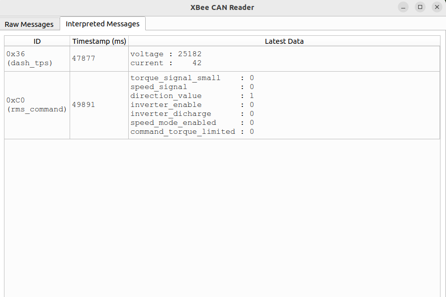

# XBeeReader

Code to read data from the XBeeReader on SN4, and render it in a nice way to help speed up debugging

To Run Demo:
- install requirements.txt
- run `python3 gui_sample.py`

To Run Live GUI:
- install requirements.txt
- run `python3 GUI.py --serial_port_name` with the serial port that is connected to Xbee Reciever

